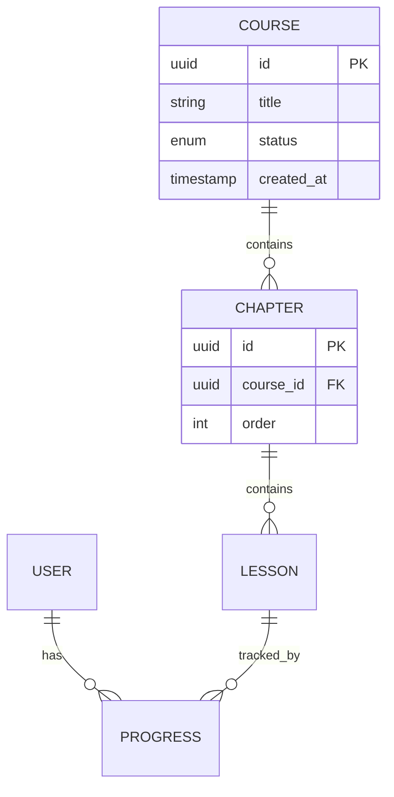

# 17 · D03 AI 输出：数据规范模板

> **阶段**：D 数据模型
> **谁产出**：AI（数据建模师）
> **落盘**：`docs/S04-data/<feature-id>/`

---

## 触发提示词

```
我已答完 D 澄清。请按 /prompt/S04-D03-AI输出-数据规范.md 多文件结构输出，
落盘到 docs/S04-data/<feature-id>/。
所有命名/通用字段/主键策略必须遵守 A 03-database。
不重定义 P 04-user-data-model 中的认证表。
未决项写入 99-open-questions.md。
```

---

## 输出多文件清单

```
docs/S04-data/<feature-id>/
  00-index.md
  01-er-diagram.md          # mermaid erDiagram
  02-entities/              # 每个实体一个文件
    <entity>.md
  03-state-machines.md       # 所有 state diagram 集中
  04-business-rules.md       # 所有约束/校验/计算
  05-indexes.md              # 索引清单与设计依据
  06-volume-growth.md        # 量级、分区、归档（无则写 N/A）
  99-open-questions.md
```

---

## 文件 1：`00-index.md`

```markdown
<!-- TARGET-PATH: docs/S04-data/<feature-id>/00-index.md -->

# 数据模型 · <feature-id> · 索引

> **阶段**：D · 数据建模师
> **关联 R-ID**：R-XXX, R-XXX
> **上游**：R 基线、A 03-database、P 04-user-data-model、D-<feature-id>-questions-resolved
> **冻结状态**：未冻结

## 实体一览

| 实体 ID | 表名 | 中文名 | 描述 | 文件 |
|--------|------|-------|------|------|
| E-1 | course | 课程 | … | 02-entities/course.md |

## 关系一览
（可链 ER 图）
```

---

## 文件 2：`01-er-diagram.md`

```markdown
<!-- TARGET-PATH: docs/S04-data/<feature-id>/01-er-diagram.md -->

# ER 图



> 复杂模型可分多张图：核心域 / 周边域 / 流水类。
```

---

## 文件 3：`02-entities/<entity>.md`（每个实体一份）

```markdown
<!-- TARGET-PATH: docs/S04-data/<feature-id>/02-entities/<entity>.md -->

# 实体：<中文名> (`<table_name>`)

## 概述
- **R-ID**：
- **业务定义**：
- **生命周期**：（链到 03-state-machines）

## 字段表

| 字段 | 类型 | 必填 | 默认 | 唯一 | 索引 | 业务说明 | 校验 |
|------|------|------|------|------|------|---------|------|
| id | uuid | ✅ | gen_random_uuid() | PK | — | 主键 | — |
| created_at | timestamptz | ✅ | now() | — | ✅ | 创建时间 | — |
| updated_at | timestamptz | ✅ | now() | — | — | 更新时间 | — |
| deleted_at | timestamptz | ❌ | NULL | — | ✅ | 软删除 | — |
| ... | | | | | | | |

## 枚举值

### `<column>` 枚举

| 值 | 中文名 | 说明 | 是否默认 |
|----|-------|------|---------|

## 关系

| 关系 | 目标 | 基数 | 外键 | 删除策略 |
|------|------|------|------|---------|
| 属于 | … | N:1 | course_id | RESTRICT |

## 计算字段（如有）

| 字段 | 公式 | 实现方式 | 缓存策略 |
|------|------|---------|---------|

## 该实体相关的业务规则
- 链到 04-business-rules 中的 BR-ID

## 索引
- 链到 05-indexes 中的 IDX-ID
```

---

## 文件 4：`03-state-machines.md`

```markdown
<!-- TARGET-PATH: docs/S04-data/<feature-id>/03-state-machines.md -->

# 状态机

## SM-1 课程状态


| 触发事件 | 触发者 | 前置条件 | 后置动作 |
|---------|-------|---------|---------|

## SM-2 ...
```

---

## 文件 5：`04-business-rules.md`

```markdown
<!-- TARGET-PATH: docs/S04-data/<feature-id>/04-business-rules.md -->

# 业务规则与约束

| BR-ID | 来源 R-ID | 涉及实体/字段 | 描述 | 实现层 | 错误码 |
|-------|----------|-------------|------|-------|-------|
| BR-1 | R-002 | course.title | 上架后 title 不可改 | DB trigger / Service | 40901 |

> 实现层取值：DB constraint / DB trigger / Service / Controller / Frontend
```

---

## 文件 6：`05-indexes.md`

```markdown
<!-- TARGET-PATH: docs/S04-data/<feature-id>/05-indexes.md -->

# 索引清单

| IDX-ID | 表 | 字段（顺序敏感） | 类型 | 唯一 | 支撑查询 | 估算行数 |
|--------|----|---------------|------|------|---------|---------|
| IDX-1 | progress | (user_id, lesson_id) | btree | ✅ | 查指定用户某课时进度 | |

## 不建索引的字段说明
> 写明为什么不建（写少 / 选择度低 / 等等）。
```

---

## 文件 7：`06-volume-growth.md`

```markdown
<!-- TARGET-PATH: docs/S04-data/<feature-id>/06-volume-growth.md -->

# 量级与增长

| 表 | 第 1 年 | 第 3 年 | 单行估算 | 分区策略 | 归档策略 |
|----|--------|--------|---------|---------|---------|
```

---

## 文件 8：`99-open-questions.md`

```markdown
<!-- TARGET-PATH: docs/S04-data/<feature-id>/99-open-questions.md -->

# 待确认问题

| 编号 | 问题 | AI 默认方案 | 影响 |
|------|------|-----------|------|
```

---

## 输出质量自检

- [ ] 8 份文件全部产出？
- [ ] 实体表里所有字段都有：类型、必填、默认、业务说明？
- [ ] 所有枚举字段都有完整枚举值与默认？
- [ ] 所有外键都有删除策略？
- [ ] 所有状态机都封闭（每个状态都有出/入边或终态）？
- [ ] 所有 BR 都标了"实现层"？
- [ ] 命名遵守 A 03-database？
- [ ] 单文件 ≤ 1200 行（实体多请拆 02-entities 子目录）？
