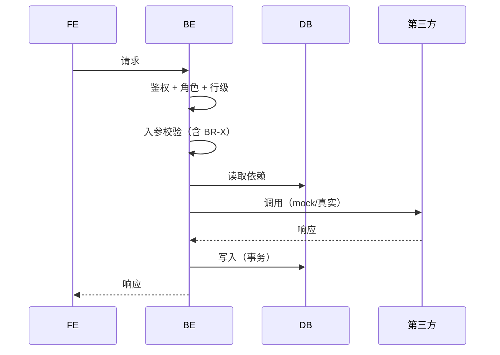

# 20 · L03 AI 输出：接口规范模板

> **阶段**：L 业务接口
> **谁产出**：AI（接口设计师）
> **落盘**：`docs/S05-api/<feature-id>/`

---

## 触发提示词

```
我已答完 L 澄清。请按 /prompt/S05-L03-AI输出-接口规范.md 多文件结构输出，
落盘到 docs/S05-api/<feature-id>/。
路径/响应/错误码必须遵守 A 04-api-conventions。
权限要求引用 P 01-roles 中的角色 ID。
入参/出参字段必须能在 D-<feature-id> 找到对应实体字段（计算字段除外）。
未决项写入 99-open-questions.md。
```

---

## 输出多文件清单

```
docs/S05-api/<feature-id>/
  00-index.md
  01-overview.md          # 资源、URL 前缀、共用 query 参数
  02-endpoints/           # 一接口一文件
    <method>-<path>.md
  03-error-codes.md       # 本 feature 的错误码
  04-events.md            # 本 feature 触发的事件/Webhook（如有）
  99-open-questions.md
```

---

## 文件 1：`00-index.md`

```markdown
<!-- TARGET-PATH: docs/S05-api/<feature-id>/00-index.md -->

# 接口规范 · <feature-id> · 索引

> **阶段**：L · 接口设计师
> **关联 R-ID**：R-XXX
> **上游**：A 04-api-conventions, P, D-<feature-id>, L-<feature-id>-questions-resolved

## 接口一览

| ID | 方法 | 路径 | 职责 | 角色 | R-ID | 文件 |
|----|------|------|------|------|------|------|
| API-1 | POST | /api/courses | 创建课程 | ROLE-EDITOR | R-002 | 02-endpoints/post-courses.md |
| API-2 | GET | /api/courses | 课程列表 | ROLE-USER | R-001 | 02-endpoints/get-courses.md |

## 公共约定补充
- 本 feature 特殊 header / 共享 query 参数
```

---

## 文件 2：`01-overview.md`

```markdown
<!-- TARGET-PATH: docs/S05-api/<feature-id>/01-overview.md -->

# 资源概览

## 资源
| 资源 | URL 前缀 | 对应实体 |
|------|---------|---------|

## 共享查询参数
| 参数 | 类型 | 默认 | 说明 |
|------|------|------|------|

## 共享 Header
| Header | 何时必带 | 说明 |
|--------|---------|------|
```

---

## 文件 3：`02-endpoints/<method>-<path>.md`（每接口一份）

```markdown
<!-- TARGET-PATH: docs/S05-api/<feature-id>/02-endpoints/<method>-<path>.md -->

# <方法> <路径> · <一句话职责>

- **API-ID**：API-N
- **关联 R-ID**：R-XXX
- **角色要求**：ROLE-XXX（多角色用 OR/AND）
- **行级要求**：（如"仅创建者可改"）
- **幂等**：是 / 否（若是，键来自：<>）
- **限流**：<次/分钟 per user>
- **是否事务**：是 / 否

## 请求

### Path Params
| 参数 | 类型 | 必填 | 说明 |
|------|------|------|------|

### Query Params
| 参数 | 类型 | 必填 | 默认 | 说明 |
|------|------|------|------|------|

### Headers
| Header | 必填 | 说明 |
|--------|------|------|

### Body (application/json)

```json
{
  "field": "..."
}
```

| 字段 | 类型 | 必填 | 校验 | 说明 | 来源（D 字段） |
|------|------|------|------|------|---------------|

## 业务流程



## 业务规则与校验
| BR-ID | 校验内容 | 失败错误码 |
|-------|---------|----------|

## 副作用
- 写日志：…
- 触发事件：…（链 04-events）
- 发通知：…

## 响应

### 成功（HTTP 200）

```json
{ "code": 0, "data": { ... }, "msg": "ok" }
```

| 字段 | 类型 | 说明 | 角色裁剪 |
|------|------|------|---------|

### 失败（按错误码）

| HTTP | 业务 code | 含义 | 触发条件 |
|------|----------|------|---------|

## 示例

### 请求
```bash
curl -X POST ...
```

### 成功响应
```json
```

### 失败响应
```json
```

## 第三方依赖与 mock
- 依赖：<>
- mock 文件：`mocks/<feature>/<endpoint>.json`
- 真实化时机：

## 测试要点
- 鉴权穿透
- 越权
- 边界值
- 幂等
- 限流
```

---

## 文件 4：`03-error-codes.md`

```markdown
<!-- TARGET-PATH: docs/S05-api/<feature-id>/03-error-codes.md -->

# 错误码（feature 内）

> 全局段位见 A 04-api-conventions。本表只列本 feature 占用的具体码。

| code | HTTP | 含义 | 提示文案 (zh) | 提示文案 (en) | 触发接口 |
|------|------|------|-------------|--------------|---------|
| 40901 | 409 | 课程上架后名称不可改 | … | … | API-3 |
```

---

## 文件 5：`04-events.md`（如有）

```markdown
<!-- TARGET-PATH: docs/S05-api/<feature-id>/04-events.md -->

# 事件 / Webhook

| 事件名 | 触发接口 | 同步/异步 | 载荷 schema | 消费方 |
|-------|---------|----------|------------|-------|
```

---

## 文件 6：`99-open-questions.md`

```markdown
<!-- TARGET-PATH: docs/S05-api/<feature-id>/99-open-questions.md -->

# 待确认问题
```

---

## 输出质量自检

- [ ] 每个 R-ID 都至少有 1 个接口承接？
- [ ] 每个接口都标了角色要求 + 行级要求？
- [ ] 每个接口的入参字段都能在 D 找到（计算字段除外）？
- [ ] 错误码范围与全局段位一致、不冲突？
- [ ] 每个接口都有时序图？
- [ ] 单文件 ≤ 1200 行（接口多就拆 02-endpoints/ 子目录）？
