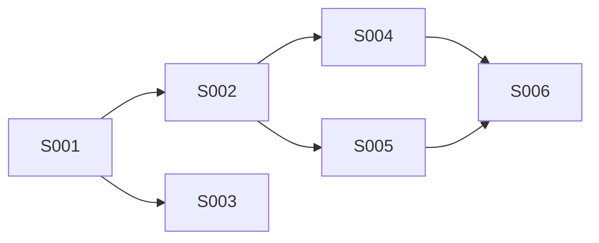
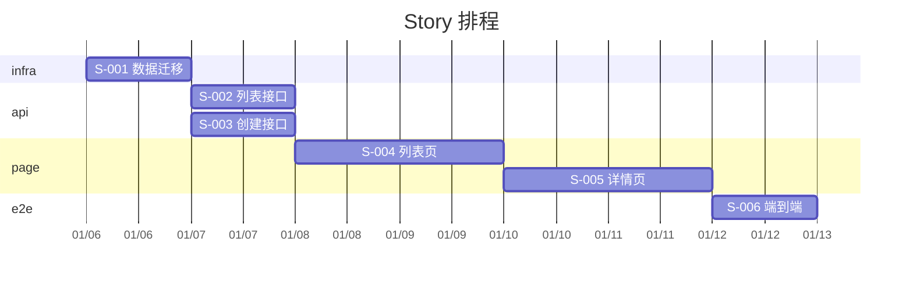

# 36 · V02 AI 输出：Story 拆分

> **阶段**：V 开发前校验
> **谁产出**：AI（项目分解师）
> **落盘**：`docs/S11-validation/<feature-id>/02-stories.md`（或 global）

---

## 触发提示词

```
V1 一致性校验已通过。请你扮演"项目分解师"，按 /prompt/S11-V02-AI输出-Story拆分.md
将本期所有 R-ID 拆为 Story。
- 单 Story 工作量目标：≤ 半天（一次提交可完成）
- 每 Story 必须有：唯一 ID、业务价值、对应 R-ID、对应文档清单、DoD、验收用例 SC-ID
- 输出 mermaid gantt 与依赖图
- 落盘 docs/S11-validation/<feature-id>/02-stories.md
```

---

## 输出文件骨架

```markdown
<!-- TARGET-PATH: docs/S11-validation/<feature-id>/02-stories.md -->

# Story 拆分 · <feature-id>

> **上游**：V1 一致性报告（已通过）
> **下游**：V3 编码上下文包

---

## 1. Story 清单

| Story-ID | 名称 | 类型 | 关联 R-ID | 关联 API/Page | 工时 | 优先级 | 依赖 |
|----------|------|------|---------|--------------|------|-------|------|
| S-001 | 数据库表创建 + 迁移 | infra | R-001~005 | docs/S04-data/course/02-entities/* | 2h | P0 | — |
| S-002 | API: GET /api/courses | api | R-005 | API-2 | 3h | P0 | S-001 |
| S-003 | API: POST /api/courses | api | R-002 | API-1 | 4h | P0 | S-001 |
| S-004 | Page: course-list | page | R-005 | course-list | 4h | P0 | S-002 |
| S-005 | Page: course-detail | page | R-006 | course-detail | 4h | P0 | S-002 |
| S-006 | E2E: 浏览课程 | e2e | R-005, R-006 | SC-1, SC-3 of course-detail | 2h | P0 | S-004, S-005 |

> 类型枚举：infra / api / page / component / e2e / ops

---

## 2. 单 Story 模板（每条 Story 详写）

### S-NNN · <名称>

- **类型**：
- **关联 R-ID**：
- **业务价值**：（一句话，"完成后我们能给用户做什么"）
- **关联文档**（喂给编码 AI 时只喂这些）：
  - docs/...（精确到文件，不要喂整个目录）
- **不喂的清单**（重要）：
  - docs/S11-validation/...
  - docs/S10-prototype/...
  - 其他无关 feature
- **DoD（完成定义）**：
  - [ ] 代码通过 lint + format
  - [ ] 单测覆盖核心分支（具体哪些）
  - [ ] 关联 SC-ID 全部跑通
  - [ ] 与 docs/30/04-api-conventions 一致
  - [ ] 不引入 docs/20/02-project-structure 之外的目录
- **验收用例**（来自 N 各页 .scenarios.md）：
  - SC-X
- **预计工时**：
- **预计代码改动行数**：
- **风险**：

---

## 3. 依赖图



---

## 4. 排程（mermaid gantt）



---

## 5. 大 Story 分解原则

- 任何 Story 估算 > 1 人日 → 必须再拆。
- 任何 Story 跨多个 R-ID 且超过 3 个 → 必须再拆。
- 任何 Story 同时改 D + L + N → 必须按层拆。

---

## 6. 拆分质量自检

- [ ] 每个 R-ID 都被至少一个 Story 覆盖？
- [ ] 每个 Story 都有 DoD？
- [ ] 每个 Story 都列了"喂给 AI 的文件"与"不喂的文件"？
- [ ] 依赖图无环？
- [ ] 没有 Story 工时 > 1 人日？
```

---

## 输出质量自检
- [ ] 6 节齐？
- [ ] R-ID 覆盖率 100%？
- [ ] 单 Story ≤ 1 人日？
- [ ] 依赖图无环？
