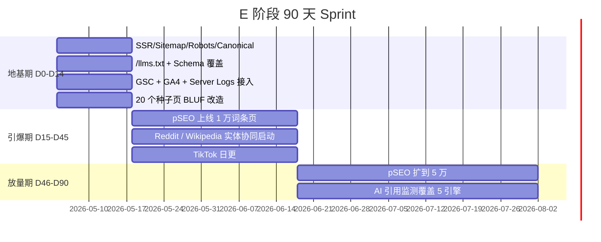

# S12-E03 · E AI 输出：SEO + GEO 营销优化方案模板

> **阶段**：E SEO + GEO 营销优化
> **谁产出**：AI（增长 / SEO + GEO 工程师）
> **落盘**：`docs/S12-marketing/`

---

## 触发提示词

```
我已答完 E 澄清。请按 /prompt/S12-E03-AI输出-SEO+GEO方案.md 多文件结构输出，
落盘到 docs/S12-marketing/。
所有数据点必须带 2025-2026 年时间戳与来源引用；所有外部工具一律给 ≥2 个候选 + 推荐。
SEO 与 GEO 必须双轮，禁止只做其中一项。
未决项写入 99-open-questions.md。
本阶段输出会被增长 / 内容 / 工程团队作为 90 天作战手册。
```

---

## 输出多文件清单

```
docs/S12-marketing/
  00-index.md
  01-strategy-overview.md          # 总策略 + 三层流量打法 + KPI
  02-keyword-strategy.md           # 关键词矩阵（按市场 / 语言 / 意图）
  03-technical-seo-nextjs.md       # 技术 SEO（SSR / sitemap / robots / canonical）
  04-onpage-content-template.md    # 落地页内容模板（标题 / Meta / 段落骨架）
  05-programmatic-seo.md           # pSEO 规划（数据源 / 模板 / 量级 / 防爆）
  06-internal-linking.md           # 内链架构（Hub / Cluster / 知识点互链）
  07-multilingual-hreflang.md      # 多语言与 hreflang
  08-schema-structured-data.md     # Schema.org / JSON-LD 覆盖矩阵
  09-core-web-vitals.md            # Core Web Vitals 优化清单
  10-llms-txt.md                   # /llms.txt 与 AI 抓取协议
  11-bluf-semantic-chunking.md     # BLUF + 语义分块写作规范
  12-citation-platforms.md         # Reddit / Wikipedia / Quora 计划
  13-video-geo.md                  # YouTube / TikTok 视频 GEO
  14-ai-engine-strategies.md       # 各 AI 引擎差异化策略
  15-entity-harmonization.md       # 实体一致性
  16-freshness-cadence.md          # 内容更新节奏
  17-monitoring.md                 # 监测栈（GSC + GA4 + Server Logs + AI 引用追踪）
  18-90day-plan.md                 # 90 天 Sprint 执行计划
  99-open-questions.md
```

> 单文件 ≤ 1200 行，超出按本目录拆。所有产物须按 `S00-04` 文档目录规划落盘。

---

## 文件 1：`00-index.md`

```markdown
<!-- TARGET-PATH: docs/S12-marketing/00-index.md -->

# SEO + GEO 营销优化 · 索引

> **阶段**：E · 增长 / SEO + GEO 工程师
> **上游**：goals.md、E-questions-resolved、R 基线、A 输出、S 输出、I 输出、D 输出
> **冻结状态**：未冻结
> **下游消费者**：增长团队、内容团队、工程团队、社区团队、数据分析

## 文件清单

| 序号 | 文件 | 职责 | 责任角色 |
|------|------|------|---------|
| 01 | 01-strategy-overview.md | 总策略 + KPI + 三层流量打法 | 全员 |
| 02 | 02-keyword-strategy.md | 关键词矩阵 | 数据 SEO + 内容 |
| 03 | 03-technical-seo-nextjs.md | 技术 SEO 检查清单 | 工程 |
| 04 | 04-onpage-content-template.md | 落地页骨架 | 内容 |
| 05 | 05-programmatic-seo.md | pSEO 规划 | 数据 SEO |
| 06 | 06-internal-linking.md | 内链架构 | 数据 SEO + 工程 |
| 07 | 07-multilingual-hreflang.md | 多语言 + hreflang | 工程 + 内容 |
| 08 | 08-schema-structured-data.md | Schema 覆盖 | 工程 + 内容 |
| 09 | 09-core-web-vitals.md | CWV 优化 | 工程 |
| 10 | 10-llms-txt.md | /llms.txt + AI 抓取 | 工程 + 内容 |
| 11 | 11-bluf-semantic-chunking.md | BLUF 写作 | 内容 |
| 12 | 12-citation-platforms.md | 被引平台计划 | 社区 + PR |
| 13 | 13-video-geo.md | 视频 GEO | 视频 |
| 14 | 14-ai-engine-strategies.md | AI 引擎策略 | 数据 + 内容 |
| 15 | 15-entity-harmonization.md | 实体协同 | PR + 内容 |
| 16 | 16-freshness-cadence.md | 更新节奏 | 内容 |
| 17 | 17-monitoring.md | 监测栈 | 数据分析 |
| 18 | 18-90day-plan.md | 90 天 Sprint | 负责人 |

## 阅读顺序

- **CEO / 负责人**：01 → 18 → 17
- **工程**：03 → 09 → 08 → 07 → 10 → 05
- **内容**：04 → 11 → 02 → 16
- **运营 / 社区**：12 → 13 → 14 → 15
- **数据**：17 → 14 → 02
```

---

## 文件 2：`01-strategy-overview.md`

```markdown
<!-- TARGET-PATH: docs/S12-marketing/01-strategy-overview.md -->

# 总体策略与 KPI

## 0. 摘要（≤ 5 行）
- <三层流量打法（SEO 长尾 / GEO 引用 / 社交裂变）的预期占比>
- <12 个月与 90 天 KPI 一句话>
- <最大风险与一票否决红线一句话>

## 1. 2026 年搜索环境前置认知
- 全球 Google 零点击率 64.82%（移动端 77.2%）
- AI 摘要出现时自然第 1 名 CTR：31.7% → 19.8%
- AI 引用流量转化率 14.2% vs 自然 2.8%（5×）
- Reddit / Wikipedia / YouTube 占 AI 引用源 ≈ 68%
- 同时拥有自然引用 + 付费广告：CTR 提升 91%

## 2. 三层流量打法

| 层 | 占比目标 | 主战场 | 核心动作 |
|----|---------|-------|---------|
| SEO 长尾 | __% | Google / Bing | pSEO + 内链 + Schema |
| GEO 引用 | __% | ChatGPT / Perplexity / AIO / Gemini | BLUF + llms.txt + 第三方协同 |
| 社交裂变 | __% | TikTok / YouTube / Reddit | 视频日更 + 硬核帖 |

## 3. SEO ↔ GEO 关系
> SEO 是流量底盘，GEO 是流量放大器；SEO 工程改造（SSR / Schema / llms.txt）= GEO 技术地基。

## 4. KPI 矩阵（SMART）
| 指标 | 数据源 | 90 天 | 6 月 | 12 月 |
|-----|-------|------|------|------|
| 月独立访客 UV | GA4 | | | |
| AI 引用率 | 自研 prompt 监测 | | | |
| Top 引擎被引份额 | Profound / 自研 | | | |
| pSEO 收录率 | GSC | | | |
| Core Web Vitals 通过率 | CrUX | | | |
| 主关键词 Top 10 数 | Ahrefs / SEMrush | | | |
| APP 下载 / 注册 | Store + 自有 | | | |

## 5. 红线
1. ...
2. ...

## 99. 待确认问题
- [ ] ...
```

---

## 文件 3：`02-keyword-strategy.md`

```markdown
<!-- TARGET-PATH: docs/S12-marketing/02-keyword-strategy.md -->

# 关键词战略矩阵

## 1. 矩阵维度
- 市场 / 语言 × 意图（Informational / Navigational / Transactional / GEO 引用专用）× 漏斗位（TOFU / MOFU / BOFU）

## 2. 种子词清单（每个 P0 市场 ≥ 30）
| 市场 | 种子词 | 月搜索量 | KD | 意图 | 对应页面（来自 I 输出） |
|------|-------|---------|----|------|----------------------|

## 3. 长尾扩展词（pSEO 用，每模板 ≥ 5,000）
（说明扩展逻辑、数据源 D 表、变量替换规则）

## 4. GEO 引用专用 prompt 清单（每市场 ≥ 50）
| Prompt 原话 | 期望引擎 | 期望被引段 | 当前命中状态 |
|------------|---------|-----------|------------|

## 5. 工具栈（≥ 2 个候选 + 推荐）
- 关键词扩展：Ahrefs / SEMrush / Keywords Everywhere / Google Keyword Planner
- AI prompt 数据：Profound / Otterly / 自研 cron
- 推荐：__；理由：__

## 99. 待确认问题
```

---

## 文件 4：`03-technical-seo-nextjs.md`

```markdown
<!-- TARGET-PATH: docs/S12-marketing/03-technical-seo-nextjs.md -->

# 技术 SEO 检查清单

> 上游：A 输出 01-tech-stack / 02-project-structure / 06-deploy-env / 07-i18n-responsive

## 1. 渲染策略矩阵（按页面类型）
| 页面类型 | 路由 | 渲染方式（SSR / SSG / ISR） | revalidate | 理由 |
|---------|-----|--------------------------|-----------|------|

## 2. sitemap.xml
- 路径：`/sitemap.xml` + 索引拆分（每文件 ≤ 50,000 URL / ≤ 50MB）
- 生成时机、增量逻辑、提交流程（GSC + Bing Webmaster + IndexNow）

## 3. robots.txt
- 全文样例
- 与 /llms.txt 的分工

## 4. canonical / hreflang / OG / Twitter Card 规范

## 5. 404 / 301 / 410 策略

## 6. 图片优化（next/image + Cloudflare Polish / 自建 CDN）

## 7. 监测埋点（Server Logs → GSC → GA4 三角校对）

## 99. 待确认问题
```

---

## 文件 5：`04-onpage-content-template.md`

```markdown
<!-- TARGET-PATH: docs/S12-marketing/04-onpage-content-template.md -->

# 落地页内容模板

## 1. Title / Meta / H1 模板（按市场 / 语言）

## 2. 页面骨架（H2 / H3 / 段落顺序）
- BLUF 首段（≤ 60 字结论）
- 关键事实表（≥ 1 张）
- 编号列表（≥ 1 个）
- FAQ 节（5 题）
- 引用 / 出处块
- 时间戳 + 作者 + 修订记录

## 3. OG 图与社交卡

## 4. 字数与多语言对照规范

## 99. 待确认问题
```

---

## 文件 6：`05-programmatic-seo.md`

```markdown
<!-- TARGET-PATH: docs/S12-marketing/05-programmatic-seo.md -->

# Programmatic SEO 规划

## 1. 模板矩阵
| 模板 ID | 路由 | 数据源（D 表） | 单类目 URL 量 | 首批上线 | 全量上线 | 防爆策略 |
|--------|-----|--------------|-------------|---------|---------|---------|

## 2. 内容质量门（防 thin content）
- 字数下限、唯一段落比、外链 / 内链下限、Schema 必备字段

## 3. 收录监测与回滚
- GSC 收录率阈值、批次提交节奏、低质 noindex 兜底

## 99. 待确认问题
```

---

## 文件 7：`06-internal-linking.md`

```markdown
<!-- TARGET-PATH: docs/S12-marketing/06-internal-linking.md -->

# 内链架构

## 1. Hub / Topic Cluster 设计
## 2. 知识点互链规则（双向 / 单向 / 防环）
## 3. 面包屑与导航链接
## 4. 链接预算（每页出链上下限）
## 5. 自动化生成方案（基于 D 表的 graph）
## 99. 待确认问题
```

---

## 文件 8：`07-multilingual-hreflang.md`

```markdown
<!-- TARGET-PATH: docs/S12-marketing/07-multilingual-hreflang.md -->

# 多语言与 hreflang

## 1. URL 结构（子目录 / 子域 / 顶级域）+ 决策依据
## 2. hreflang 矩阵（含 x-default）
## 3. 翻译流水线（D 表多语言字段 → CMS → 静态构建 → 校对）
## 4. 区域定向（Geo-IP 跳转 vs 不跳转的取舍）
## 99. 待确认问题
```

---

## 文件 9：`08-schema-structured-data.md`

```markdown
<!-- TARGET-PATH: docs/S12-marketing/08-schema-structured-data.md -->

# Schema.org 结构化数据

## 1. 覆盖矩阵
| 页面类型 | Schema 类型 | 必填字段 | 选填字段 | 验证工具 |
|---------|-----------|---------|---------|---------|
| 知识点页 | DefinedTerm + Course | | | Rich Results Test |
| 文化文章 | Article + BreadcrumbList | | | |
| 课程页 | Course + LearningResource | | | |
| 视频页 | VideoObject | | | |
| FAQ 页 | FAQPage | | | |
| 全站 | Organization + WebSite + SearchAction | | | |

## 2. JSON-LD 注入位置 + 自动化生成
## 3. 与 Wikidata 实体的 sameAs 对接
## 99. 待确认问题
```

---

## 文件 10：`09-core-web-vitals.md`

```markdown
<!-- TARGET-PATH: docs/S12-marketing/09-core-web-vitals.md -->

# Core Web Vitals 优化

## 1. 现状基线（CrUX 实测）
| 指标 | P75 现状 | 目标 | 关键瓶颈 |
|-----|---------|------|---------|
| LCP | | < 2.5s | |
| INP | | < 200ms | |
| CLS | | < 0.1 | |

## 2. 优化清单（按收益排序）
## 3. 监测节奏（CrUX + Lighthouse CI + 真实用户）
## 99. 待确认问题
```

---

## 文件 11：`10-llms-txt.md`

```markdown
<!-- TARGET-PATH: docs/S12-marketing/10-llms-txt.md -->

# /llms.txt 与 AI 抓取协议

## 1. /llms.txt 全文样例（覆盖目录索引 + 关键事实块入口）
## 2. /llms-full.txt（全量精简版）的拆分策略
## 3. AI 引擎 user-agent 矩阵与 robots / 头部策略（GPTBot / ClaudeBot / PerplexityBot / Google-Extended / CCBot / Bytespider …）
## 4. 与 robots.txt 的边界
## 5. 是否对接 ChatGPT Apps / Perplexity Sources 等接入计划
## 99. 待确认问题
```

---

## 文件 12：`11-bluf-semantic-chunking.md`

```markdown
<!-- TARGET-PATH: docs/S12-marketing/11-bluf-semantic-chunking.md -->

# BLUF + 语义分块写作规范

## 1. BLUF 首段公式（结论 + 数字 + 时戳）
## 2. 段落语义分块规则（每块 ≤ 120 字 + 自包含）
## 3. 表格 / 编号列表 / FAQ 的 AI 友好格式
## 4. 时戳 / 作者 / 来源块强制位
## 5. 内容审核 checklist（是否被 AI 抽取友好）
## 99. 待确认问题
```

---

## 文件 13：`12-citation-platforms.md`

```markdown
<!-- TARGET-PATH: docs/S12-marketing/12-citation-platforms.md -->

# 被引平台计划（Reddit / Wikipedia / Quora / 论坛）

## 1. 平台优先级矩阵（按市场）
## 2. 账号矩阵 vs 单一账号决策
## 3. Reddit
- 子版选择、发帖节奏、AMA、平台改写矩阵
## 4. Wikipedia / Wikidata
- 实体页存在性检查、Wikidata 节点建立、可被引来源准备
## 5. Quora / Stack Exchange / 本地论坛
## 6. 内容改写矩阵（同事实、不同包装）
## 7. 反垃圾红线 + 平台合规
## 99. 待确认问题
```

---

## 文件 14：`13-video-geo.md`

```markdown
<!-- TARGET-PATH: docs/S12-marketing/13-video-geo.md -->

# 视频 GEO（YouTube / YouTube Shorts / TikTok）

## 1. 内容矩阵（30s / 60s / 长视频）
## 2. 标题 / 描述 / 字幕 / 章节 / 时间戳的 AI 抽取友好规范
## 3. 视频 Schema（VideoObject + Clip + SeekToAction）
## 4. TikTok 推荐流策略 vs YouTube 搜索策略
## 5. 字幕多语言流水线
## 6. KPI（被 AI 引用的视频特征：40.83% 播放量 < 1000）
## 99. 待确认问题
```

---

## 文件 15：`14-ai-engine-strategies.md`

```markdown
<!-- TARGET-PATH: docs/S12-marketing/14-ai-engine-strategies.md -->

# AI 引擎差异化策略

## 1. 引擎矩阵
| 引擎 | 抓取来源 | 引用偏好 | 我们的优先级 | 主要打法 |
|-----|---------|---------|------------|---------|
| ChatGPT (Search) | Bing + 自抓 + 合作 | 权威源 + 结构化 | | |
| Perplexity | 自抓 + Sources 计划 | 多源对比 | | |
| Google AIO | Google 索引 | 结构化 + EEAT | | |
| Gemini | Google + YouTube | 结构化 + 视频 | | |
| Claude | 部分 web | 长文 + 学术 | | |
| Copilot | Bing | Bing 索引强相关 | | |
| 豆包 / DeepSeek / Kimi / 文心 | 国内为主 | 中文事实 | | |

## 2. 各引擎接入计划（如有）
## 3. 引擎被引监测方法
## 99. 待确认问题
```

---

## 文件 16：`15-entity-harmonization.md`

```markdown
<!-- TARGET-PATH: docs/S12-marketing/15-entity-harmonization.md -->

# 实体一致性（Entity Harmonization）

## 1. 实体清单（品牌 / 产品 / 创始人 / 关键人 / 关键术语）
## 2. 各平台资料对齐表（官网 / Wikipedia / Wikidata / Crunchbase / LinkedIn / GitHub / Apple App Store / Google Play / 各社交）
## 3. sameAs 链路与 Organization Schema 对接
## 4. 名称 / 描述 / Logo 一致性 SOP
## 99. 待确认问题
```

---

## 文件 17：`16-freshness-cadence.md`

```markdown
<!-- TARGET-PATH: docs/S12-marketing/16-freshness-cadence.md -->

# 内容更新节奏

## 1. 各资产更新周期表
## 2. 变更触发：sitemap lastmod / Schema dateModified / 内链重抓 / IndexNow
## 3. 冻结策略（已冻结 vs 滚动更新）
## 4. 大事件 / 节日 / 节气日历
## 99. 待确认问题
```

---

## 文件 18：`17-monitoring.md`

```markdown
<!-- TARGET-PATH: docs/S12-marketing/17-monitoring.md -->

# 监测栈

## 1. 数据源
- GSC / Bing Webmaster / IndexNow
- GA4 / 自有事件 / Server Logs
- AI 引用追踪：Profound / Otterly / 自研 cron（每市场 ≥ 50 prompts）
- Rank：Ahrefs / SEMrush
- CWV：CrUX + Lighthouse CI

## 2. 周报模版（含 KPI 红绿灯）
## 3. 告警规则（收录率断崖 / 引用份额下跌 / CWV 退化）
## 4. 工程脚本边界（哪些自研、哪些用 SaaS、≥2 候选 + 推荐）
## 99. 待确认问题
```

---

## 文件 19：`18-90day-plan.md`

```markdown
<!-- TARGET-PATH: docs/S12-marketing/18-90day-plan.md -->

# 90 天 Sprint 执行计划

## 0. 时间轴



## 1. 三阶段交付物 + 验收标准（详细列表）
| 阶段 | 交付物 | 验收标准 | 责任人 |
|------|-------|---------|-------|

## 2. 责任矩阵（RACI）
## 3. 风险登记
## 99. 待确认问题
```

---

## 文件 20：`99-open-questions.md`

```markdown
<!-- TARGET-PATH: docs/S12-marketing/99-open-questions.md -->

# 待确认问题（E 阶段汇总）

> 凡是未在 18 份子文件中收敛的问题，全部归这里。归到本文件 = 阻断 G-E 闸门。

- [ ] ...
- [ ] ...
```

---

## 出稿自检（AI 自查）

- [ ] 18 份子文件全部产出？
- [ ] 每份文件都有 `<!-- TARGET-PATH: ... -->`？
- [ ] 每份文件都有 `99 待确认问题`（或在总 99 中合并）？
- [ ] 每个数据点都带 2025-2026 年时间戳与来源？
- [ ] 每个外部工具都给了 ≥2 个候选 + 推荐？
- [ ] 90 天计划与 KPI 一一对齐？
- [ ] SEO 与 GEO 是否双轮（不能只做其一）？
- [ ] hreflang / 渲染策略 / Schema 与 A 阶段输出对齐？
- [ ] pSEO 数据源与 D 阶段输出对齐？
- [ ] 任何一项 No → 重写不许提交。
