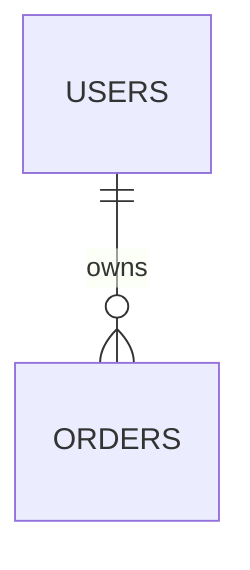

# 40 · E03 AI 输出：产品需求文档（PRD）模板

> **阶段**：E 产品需求文档（PRD）
> **谁产出**：AI（产品经理）
> **何时产出**：用户回完 E 澄清清单后。
> **落盘**：`docs/S12-prd/` 下多个文件（见 `S00-04` 文档目录规划）

---

## AI 必须遵守

1. **只读**：E 用户输入 + E-questions-round*-resolved + R / A / P / D / L / X / S / I / N / H / V 全部冻结产物 + `S00-01` + `S00-03` + `S00-04` + 本模板。
2. **不许做**：新增需求、改写上游字段、引入新角色、画新原型、写代码 / SQL / 详细 API 字段。
3. PRD 是**面向接手者的总章**，不是"再做一次产品设计"。每一句话必须能回链到上游某个 ID 或某份冻结文件，否则放 §99。
4. 仍存疑的写到 §99，不要在正文猜。
5. 单文件 ≤ 1200 行，超出按本模板拆。
6. 每个子文件必须以 `<!-- TARGET-PATH: ... -->` 开头。
7. 每个子文件必须含 `99 待确认问题`（或归入总 99）。
8. 全文统一使用 E01 §6 的术语表，不得自创同义词。

---

## 触发提示词

```
我已答完 E 澄清。请按 /prompt/S12-E03-AI输出-产品需求文档.md 的多文件结构输出，
落盘到 docs/S12-prd/ 下对应文件，并在 00-index.md 中索引。
单文件 ≤ 1200 行，超出按主题继续拆。
凡仍存疑的，记入对应子文件的 99 节，不要自行猜测。
```

---

## 输出多文件清单

AI 必须按下列顺序逐文件产出，每个文件独立用 `<!-- TARGET-PATH: ... -->` 标注路径。

```
docs/S12-prd/
  00-index.md                       ← 索引 + 接手第一周阅读路线
  01-overview.md                    ← 产品总览（定位 / 当前形态 / 版本 / 阅读对象）
  02-glossary.md                    ← 业务术语表
  03-personas.md                    ← 用户画像与典型场景
  04-feature-catalog.md             ← 模块清单（产品视角）
  05-user-journeys.md               ← 关键用户旅程（mermaid）
  06-page-specs/
    00-index.md                     ← 页面索引（page-id → 模块映射）
    <page-id>.md                    ← 单页规格（按 I / N / H 复述 + 截图）
  07-business-rules.md              ← 业务规则汇总
  08-data-model-summary.md          ← 数据模型摘要（ER + 表名职责）
  09-api-summary.md                 ← 接口摘要（按模块列 endpoint + 一行职责）
  10-roles-permissions.md           ← 角色 × 模块 权限矩阵
  11-design-summary.md              ← 视觉与体验摘要
  12-tech-stack-summary.md          ← 技术栈摘要 + 接手第一周环境步骤
  13-known-issues.md                ← 已知缺陷与历史包袱
  14-roadmap.md                     ← 后续迭代方向
  15-changelog.md                   ← PRD 自身的版本变更记录
  99-open-questions.md              ← 未决问题汇总
  _input/prd-context.md             ← E 用户输入存档
```

---

## 文件 1：`00-index.md`

```markdown
<!-- TARGET-PATH: docs/S12-prd/00-index.md -->

# 产品需求文档 · 索引

> **阶段**：E · 产品经理
> **上游依赖**：docs/S12-prd/_input/prd-context.md，以及 R / A / P / D / L / X / S / I / N / H / V 全部冻结产物
> **冻结状态**：未冻结
> **目标读者**：<复述 E01 §0 的"阅读对象">

---

## 文件清单

| 序号 | 文件 | 职责 | 何时阅读 |
|------|------|------|---------|
| 01 | 01-overview.md | 一句话定位 / 现状 / 版本 / 阅读对象 | 第一份 |
| 02 | 02-glossary.md | 业务术语表 | 看到陌生词时 |
| 03 | 03-personas.md | 用户画像与典型场景 | 理解"为谁做"时 |
| 04 | 04-feature-catalog.md | 模块清单 | 想知道"做了哪些块" |
| 05 | 05-user-journeys.md | 关键用户旅程 | 想看"用户怎么用" |
| 06 | 06-page-specs/ | 单页规格 | 改某页前必读 |
| 07 | 07-business-rules.md | 业务规则汇总 | 写校验 / 排错时 |
| 08 | 08-data-model-summary.md | 数据模型摘要 | 改库前 |
| 09 | 09-api-summary.md | 接口摘要 | 调接口前 |
| 10 | 10-roles-permissions.md | 角色 × 模块 权限矩阵 | 改权限前 |
| 11 | 11-design-summary.md | 视觉与体验摘要 | 改 UI 前 |
| 12 | 12-tech-stack-summary.md | 技术栈摘要 + 环境搭建 | 第一周配环境 |
| 13 | 13-known-issues.md | 已知缺陷与历史包袱 | 接手第一天必读 |
| 14 | 14-roadmap.md | 后续迭代方向 | 排期 / 决策时 |
| 15 | 15-changelog.md | PRD 自身变更记录 | 比对版本时 |
| 99 | 99-open-questions.md | 未决问题汇总 | 评审时 |

---

## 接手第一周阅读路线（推荐顺序）

1. Day 1：01 → 13 → 14（先看总览 + 坑 + 方向，知道接手了一个什么形态的产品）
2. Day 2：02 → 03 → 04（搞懂术语 / 用户 / 模块边界）
3. Day 3：12（按步骤把本地环境跑起来）
4. Day 4：05 → 06 任选 2-3 个核心页（跟着用户旅程把原型点一遍）
5. Day 5：07 → 10（业务规则与权限矩阵）
6. 后续：08 / 09 / 11 按需要查
```

---

## 文件 2：`01-overview.md`

```markdown
<!-- TARGET-PATH: docs/S12-prd/01-overview.md -->

# 产品总览

## 0. 摘要（≤ 5 行）
- 给谁：...
- 做什么：...
- 当前形态：<原型 / 部分实现 / 已上线>
- 关键差异点：...
- 最大已知风险：...

## 1. 一句话定位
<复述 E01 §1>

## 2. 当前形态
| 字段 | 内容 |
|------|------|
| 原型来源 / 路径 | |
| 实现进度 | |
| 仓库 / 分支 / commit | |
| 部署环境 | |

## 3. PRD 版本与阅读对象
| 字段 | 内容 |
|------|------|
| 当前版本 | v1.x |
| 编写日期 | |
| 作者 | |
| 阅读对象 | |
| 读者技术水平 | |

## 4. 范围声明
- ① 已实现（写进本 PRD 正文）：...
- ② 已规划未实现（仅在 14-roadmap.md 列名）：...
- ③ 已废弃（不写）：...
```

---

## 文件 3：`02-glossary.md`

```markdown
<!-- TARGET-PATH: docs/S12-prd/02-glossary.md -->

# 业务术语表

> 全 PRD 必须使用本表术语；不得使用"不要用的同义词"列出的词。

| 术语 | 定义 | 对应 D 表 / 字段 | 不要用的同义词 |
|-----|------|----------------|--------------|
| | | | |
```

---

## 文件 4：`03-personas.md`

```markdown
<!-- TARGET-PATH: docs/S12-prd/03-personas.md -->

# 用户画像与典型场景

| 角色 ID（来自 P） | 一句话画像 | 主要使用场景 | 频次 / 典型 session | 关心的指标 |
|-----------------|-----------|------------|-------------------|-----------|
| | | | | |

## 典型一日使用脚本（每个核心角色 1-2 段）

### <角色 ID>
> 一段叙事文字，描述该角色一天里何时打开产品 / 做什么 / 何时离开。
```

---

## 文件 5：`04-feature-catalog.md`

```markdown
<!-- TARGET-PATH: docs/S12-prd/04-feature-catalog.md -->

# 模块清单

> 与 E01 §7 一一对应；任何一个模块都能在 06-page-specs/ 找到对应页面文件。

| 模块 ID | 模块名 | 一句话职责 | 主要角色 | 关联页面 ID | 关联 Story（V2） | 关联接口（L） | 关联表（D） |
|--------|-------|----------|---------|-----------|----------------|-------------|-----------|
| M-001 | | | | | | | |

## 每个模块一段产品语言描述

### M-001 <模块名>
> 3-5 行，从产品视角解释这个模块"为什么存在 / 解决什么 / 与其他模块的关系"。
> 不写技术细节，技术细节回查 D / L 阶段。
```

---

## 文件 6：`05-user-journeys.md`

```markdown
<!-- TARGET-PATH: docs/S12-prd/05-user-journeys.md -->

# 关键用户旅程

> 每条旅程：1 段叙事 + 1 张 mermaid。复述 R baseline §5 即可，不要新增分支。

## 旅程 1：<名称>
> 触发场景：...
> 角色：...
> 期望结果：...


## 旅程 2：...
```

---

## 文件 7：`06-page-specs/00-index.md` 与 `<page-id>.md`

```markdown
<!-- TARGET-PATH: docs/S12-prd/06-page-specs/00-index.md -->

# 页面规格索引

| 页面 ID | 页面名 | 所属模块 | 路由 | 主要角色 | 状态 | 文件 |
|--------|-------|---------|------|--------|------|------|
| P-001 | | M-001 | /xxx | | 已实现 | [P-001](./P-001.md) |
```

```markdown
<!-- TARGET-PATH: docs/S12-prd/06-page-specs/<page-id>.md -->

# <页面 ID> · <页面名>

> 所属模块：M-XXX · 路由：/xxx · 上游引用：S08-ia/02-pages.md §X、S09-pages/<f>/<page-id>.md、S10-prototype/pages/<scope>-<page>.html

## 1. 页面用途（一句话）

## 2. 主要使用角色与场景

## 3. 关键元素清单（按视觉从上到下）
| 区域 | 元素 | 数据来源（D 表 / 字段） | 行为 |
|------|------|---------------------|------|

## 4. 四态
| 态 | 触发 | 表现 | 截图 |
|----|------|------|------|
| 展示 | | |  |
| 操作 | | | |
| 空 | | | |
| 错 | | | |
| 加载 | | | |
| 无权限 | | | |

## 5. 涉及业务规则（链接到 07-business-rules.md）
- BR-X：...

## 6. 涉及接口（链接到 09-api-summary.md）
- API-XXX：...

## 99. 待确认问题
```

---

## 文件 8：`07-business-rules.md`

```markdown
<!-- TARGET-PATH: docs/S12-prd/07-business-rules.md -->

# 业务规则汇总

> 来源：R baseline §6、D <feature>/05-validations.md、L <feature>/03-error-codes.md。本表只复述，不新增。

| 规则 ID | 描述 | 上游来源 | 触发场景 | 边界值 / 异常处理 | 关联模块 | 关联页面 |
|--------|------|---------|---------|----------------|---------|---------|
| BR-001 | | R-XXX / D-XXX | | | M-XXX | P-XXX |
```

---

## 文件 9：`08-data-model-summary.md`

```markdown
<!-- TARGET-PATH: docs/S12-prd/08-data-model-summary.md -->

# 数据模型摘要

> 仅给"表名 + 一句职责 + 关键关系"。字段详情请回查 docs/S04-data/。

## 1. 总览 ER 图



## 2. 表清单

| 表名 | 所属模块 | 一句职责 | 详情链接 |
|-----|---------|---------|---------|
| | | | docs/S04-data/<f>/01-tables.md |

## 3. 关键状态机（如有，按表列出）
```

---

## 文件 10：`09-api-summary.md`

```markdown
<!-- TARGET-PATH: docs/S12-prd/09-api-summary.md -->

# 接口摘要

> 仅给"endpoint + 方法 + 一句职责"。请求 / 响应字段请回查 docs/S05-api/。

| 模块 | endpoint | 方法 | 一句职责 | 角色 | 详情链接 |
|-----|---------|------|---------|------|---------|
| M-001 | /api/... | GET | | | docs/S05-api/<f>/02-endpoints/get-xxx.md |
```

---

## 文件 11：`10-roles-permissions.md`

```markdown
<!-- TARGET-PATH: docs/S12-prd/10-roles-permissions.md -->

# 角色 × 模块 权限矩阵

> 数据来源：docs/S03-permissions/03-authz-mechanism.md。本表为简化矩阵，细则回查上游。

| 模块 / 操作 | ROLE-USER | ROLE-EDITOR | ROLE-ADMIN |
|-----------|-----------|-------------|------------|
| M-001 看 | ✅ | ✅ | ✅ |
| M-001 写 | — | ✅ | ✅ |

## 角色定义速记
- ROLE-USER：...
- ROLE-EDITOR：...
- ROLE-ADMIN：...

## 认证流程速记
（一段话 + 一张 mermaid 时序图，引自 docs/S03-permissions/02-auth-flow.md）
```

---

## 文件 12：`11-design-summary.md`

```markdown
<!-- TARGET-PATH: docs/S12-prd/11-design-summary.md -->

# 视觉与体验摘要

> 数据来源：docs/S06-ux/、docs/S07-design-system/。本文件只摘要，不复述全文。

## 1. 体验定调（一句话）
## 2. 主品牌色与语义色
| 用途 | 色值 |
|------|------|
| Primary | |
| Success | |
| Warning | |
| Danger | |
## 3. 字体与字号
## 4. 主要组件参考截图（链接到原型 / Figma）
| 组件 | 截图 / 链接 |
|------|------------|
| 按钮 | |
| 表格 | |
| 表单 | |
## 5. 暗黑模式 / 响应式策略（一句话）
```

---

## 文件 13：`12-tech-stack-summary.md`

```markdown
<!-- TARGET-PATH: docs/S12-prd/12-tech-stack-summary.md -->

# 技术栈摘要 + 接手第一周环境步骤

> 数据来源：docs/S02-architecture/。本文件给"接手者最快上手版"。

## 1. 技术栈速记
| 层 | 选型 | 版本 |
|----|------|------|
| 前端 | | |
| 后端 | | |
| 数据库 | | |
| 部署 | | |

## 2. 仓库目录速记
（一段树形 + 一行注释，详情回查 docs/S02-architecture/02-project-structure.md）

## 3. 接手第一周环境搭建步骤
```bash
# 1. clone
# 2. 装依赖
# 3. 起本地数据库 / 跑迁移
# 4. 起 dev server
# 5. 看到 hello world
```

## 4. 测试 / 部署 / 监控入口
| 用途 | 链接 |
|------|------|
| dev | |
| staging | |
| prod | |
| 监控面板 | |
| 错误追踪 | |
```

---

## 文件 14：`13-known-issues.md`

```markdown
<!-- TARGET-PATH: docs/S12-prd/13-known-issues.md -->

# 已知缺陷与历史包袱

> 接手者第一天必读。来源：E01 §9 + 上游 99-open-questions 的历史问题。

| 编号 | 类型 | 描述 | 影响范围 | 复现步骤 / 触发条件 | 当前规避方式 | 计划修复时间 | 严重度 |
|-----|------|------|---------|-----------------|------------|------------|--------|
| KI-001 | | | | | | | 高 / 中 / 低 |
```

---

## 文件 15：`14-roadmap.md`

```markdown
<!-- TARGET-PATH: docs/S12-prd/14-roadmap.md -->

# 后续迭代方向

> 仅列方向 + 状态，不承诺时间。来源：E01 §10。

| 编号 | 方向 | 状态 | 已知约束 / 暂缓原因 | 关联模块 |
|-----|------|------|------------------|---------|
| RM-001 | | 已立项 / 仅构想 / 已暂停 | | |
```

---

## 文件 16：`15-changelog.md`

```markdown
<!-- TARGET-PATH: docs/S12-prd/15-changelog.md -->

# PRD 变更记录

| 版本 | 日期 | 作者 | 变更摘要 | 涉及子文件 | 关联代码 commit |
|-----|------|------|---------|----------|----------------|
| v1.0 | YYYY-MM-DD | | 首版 | 全部 | |
```

---

## 文件 17：`99-open-questions.md`

```markdown
<!-- TARGET-PATH: docs/S12-prd/99-open-questions.md -->

# 待确认问题（PRD 阶段汇总）

> 凡未在子文件内收敛的，全部归这里。本文件非空 → 不可冻结。

- [ ] 编号：<问题>（影响：<子文件 / 模块 / 页面 ID>）
```

---

## 出稿自检（AI 自查）

- [ ] 17 份子文件全部产出？
- [ ] 每份子文件都带 `<!-- TARGET-PATH: ... -->`？
- [ ] 每份子文件都有 99 节（或归入总 99）？
- [ ] PRD 全文每一句话都能回链到 E01 字段或上游某 ID？
- [ ] 是否引入了上游没有的新需求 / 新角色 / 新字段？（违规：删除并放入 §99）
- [ ] 全文术语是否统一使用 E01 §6 的术语表？
- [ ] §3 范围声明的 ① 桶是否在 04-feature-catalog 与 06-page-specs 全部覆盖？
- [ ] §3 ② 桶是否在 14-roadmap 全部出现且仅出现在那里？
- [ ] §3 ③ 桶是否真的没出现在任何子文件正文？
- [ ] 单文件 ≤ 1200 行？

任何一项 No → 重写，不许提交。
